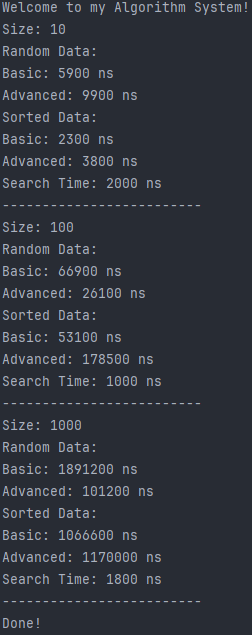

# Assignment 3: Sorting and Searching Algorithm Analysis

## Project Overview
This project is an analysis system designed to measure and compare the performance of various sorting and searching algorithms. I implemented **Selection Sort** (Basic), **Quick Sort** (Advanced), and **Binary Search** (Searching) to observe their behavior across different array sizes and initial data states (Random vs Sorted).

## Algorithm Descriptions

1. **Selection Sort (Basic Sorting):**
   - **How it works:** It repeatedly finds the minimum element from the unsorted part and puts it at the beginning of the sorted part.
   - **Time Complexity:** O(n^2) in all cases (best, average, worst).

2. **Quick Sort (Advanced Sorting):**
   - **How it works:** A divide-and-conquer algorithm that picks a 'pivot' element and partitions the array into two sub-arrays (elements smaller than pivot and larger than pivot).
   - **Time Complexity:** Average O(n log n), Worst case O(n^2).

3. **Binary Search (Searching):**
   - **How it works:** Finds a target value within a sorted array by repeatedly dividing the search interval in half.
   - **Time Complexity:** O(log n).

## Experimental Results
Execution time measured in nanoseconds (ns) using System.nanoTime().

### 1. Random (Unsorted) Arrays
| Array Size | Selection Sort (Basic) | Quick Sort (Advanced) | Binary Search |
| :--- | :--- | :--- | :--- |
| **10** | 5,900 ns | 9,900 ns | 2,000 ns |
| **100** | 66,900 ns | 26,100 ns | 1,000 ns |
| **1000** | 1,891,200 ns | 101,200 ns | 1,800 ns |

### 2. Already Sorted Arrays
| Array Size | Selection Sort (Basic) | Quick Sort (Advanced) |
| :--- | :--- | :--- |
| **10** | 2,300 ns | 3,800 ns |
| **100** | 53,100 ns | 178,500 ns |
| **1000** | 1,066,600 ns | 1,170,000 ns |

## Analysis and Findings

1. **Which sorting algorithm performed faster? Why?**
   On large random datasets (1000 elements), **Quick Sort** was much faster (101,200 ns) than Selection Sort (1,891,200 ns). This is because Quick Sort uses a divide-and-conquer approach, which is far more efficient than the nested loops of Selection Sort.

2. **How does performance change with input size?**
   As the size increased 10x (from 100 to 1000), Selection Sort's execution time grew nearly 30x (from 66k to 1.8M), which reflects its quadratic growth. Quick Sort's time grew much more slowly on random data.

3. **How does sorted vs unsorted data affect performance?**
   Selection Sort performed slightly faster on sorted data but remained slow. However, **Quick Sort significantly slowed down** on already sorted data (from 101k to 1.17M). This is a classic case where a sorted array triggers the worst-case O(n^2) for Quick Sort when the pivot selection is not randomized.

4. **Do the results match the expected Big-O complexity?**
   Yes. The results clearly demonstrate the difference between quadratic growth **O(n^2)** and linearithmic growth **O(n log n)** for sorting, and the high efficiency of logarithmic growth **O(log n)** for searching.

5. **Which searching algorithm is more efficient? Why?**
   **Binary Search** is extremely efficient. Even as the array size grew, the search time stayed very low (under 2000 ns) because it eliminates half of the remaining elements in each step.

6. **Why does Binary Search require a sorted array?**
   It requires a sorted array to make a logical decision: if the target is less than the middle element, it must be in the left half; if it's greater, it must be in the right half. Without sorting, this logic doesn't work.

## Reflection
This assignment provided a clear practical look at algorithm efficiency. I learned that theoretical complexities like O(n^2) and O(n log n) have a very real impact on performance. Seeing Quick Sort hit its "worst-case" scenario on sorted data was the most interesting part of the experiment. The main challenge was ensuring the classes were structured properly and arrays were cloned correctly for fair testing.
## Program Output Screenshot

